# System Design Document — MVP SaaS Platform

## 1. ภาพรวมสถาปัตยกรรม (Architecture Overview)

### 1.1 Service Topology

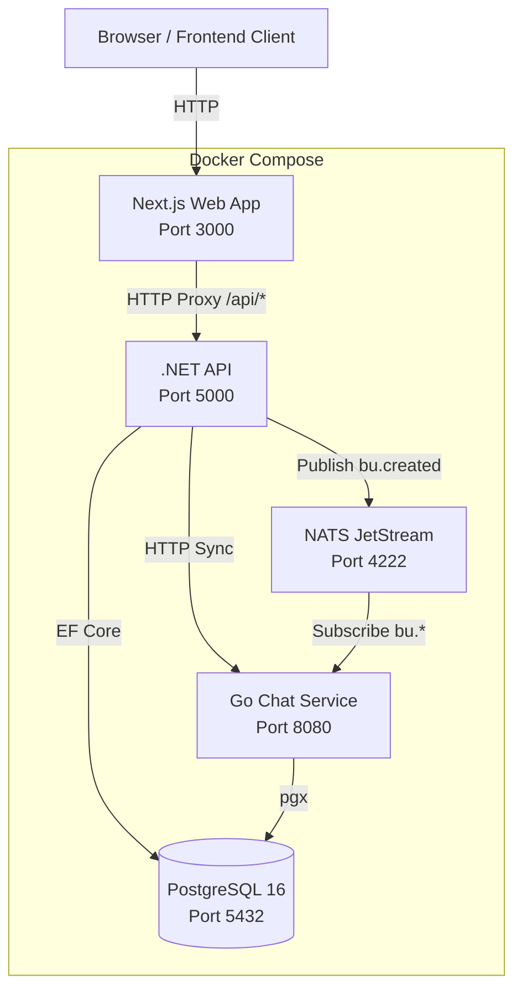

### 1.2 Technology Stack

| Layer | Technology | หน้าที่ |
|-------|-----------|--------|
| Frontend | Next.js 16, React 19, TanStack Query, Zustand | UI, State Management, BFF Proxy |
| API | .NET 10 Minimal APIs, MediatR, EF Core | Business Logic, CQRS, Multi-Tenancy |
| Chat Service | Go 1.25, Echo v4, pgx/v5 | Chat Workspace Management |
| Database | PostgreSQL 16 | Data Persistence (2 schemas) |
| Messaging | NATS JetStream | Async Event-Driven Communication |
| Container | Docker Compose | Local Development & Deployment |

### 1.3 Architectural Patterns

- **.NET API:** Vertical Slice Architecture (VSA) + CQRS ผ่าน MediatR — แต่ละ Feature มีโฟลเดอร์ของตัวเอง (Command, Handler, Endpoint)
- **Go Chat Service:** Clean Architecture — แบ่งเป็น Domain, Use Case, Repository, Delivery layers
- **Frontend:** Next.js App Router + BFF Proxy Pattern — ทุก API request ผ่าน `/api/[...path]` route handler ก่อนถึง backend

---

## 2. Database Schema (ER Diagram)

### 2.1 Schema `main` (เป็นของ .NET API)

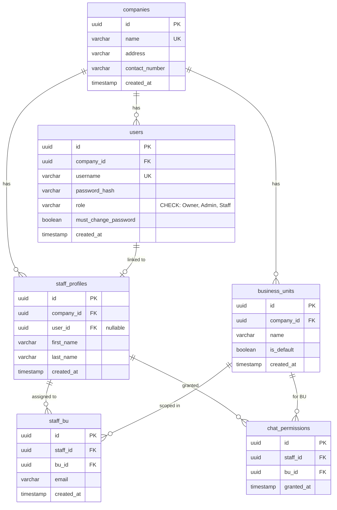

### 2.2 Schema `chat` (เป็นของ Go Chat Service)

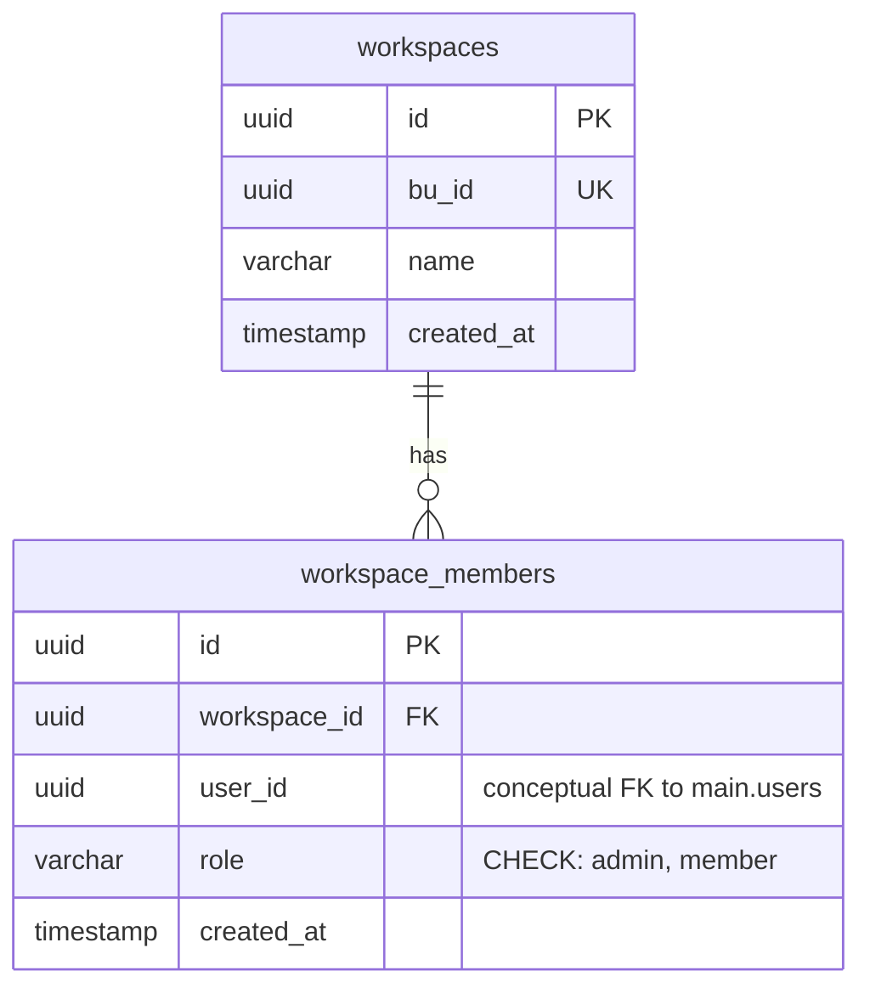

**หมายเหตุ:** ไม่มี Foreign Key ข้าม schema — `workspace_members.user_id` เชื่อมกับ `main.users.id` ผ่าน NATS events และ HTTP sync เท่านั้น

---

## 3. Multi-Tenancy Strategy

### 3.1 Row-Level Isolation

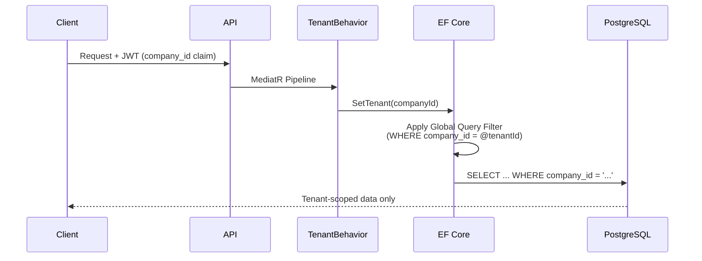

### 3.2 รายละเอียด

- **กลยุทธ์:** Row-Level Isolation ด้วยคอลัมน์ `company_id` ในทุกตารางหลัก
- **การทำงาน:** `TenantBehavior` (MediatR Pipeline Behavior) อ่าน `company_id` จาก JWT claim แล้วเรียก `AppDbContext.SetTenant()` ซึ่งจะ activate EF Core Global Query Filters
- **ตารางที่มี filter:** `business_units`, `users`, `staff_profiles`
- **ตารางที่ไม่มี filter:** `companies` (เจตนา — ใช้ตอน onboard), `staff_bu` (filter ผ่าน join กับ `staff_profiles`), `chat_permissions` (filter ผ่าน join กับ `business_units`)

### 3.3 JWT Claims

```json
{
  "sub": "<user_id>",
  "company_id": "<company_id>",
  "role": "Owner | Admin | Staff",
  "iss": "mvp-api",
  "aud": "mvp-web",
  "exp": "<24 hours>"
}
```

---

## 4. Inter-Service Communication

### 4.1 Async: NATS JetStream (BU Provisioning)

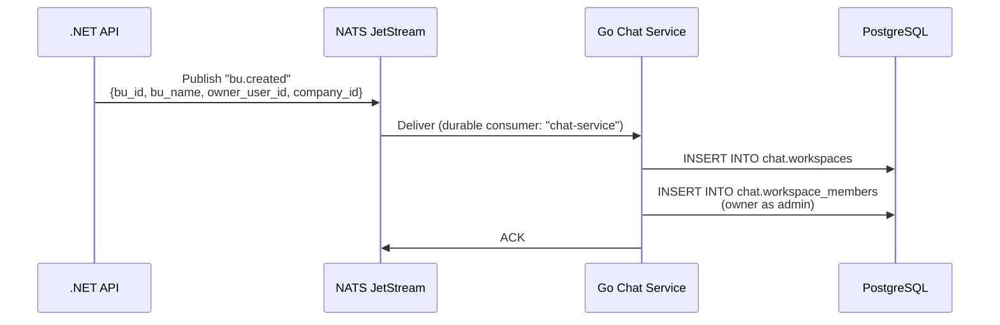

**Stream Configuration:**
- Stream: `PLATFORM_EVENTS`
- Subjects: `bu.*`
- Retention: `WorkQueue` (ลบหลัง ACK)
- Consumer: `chat-service` (durable, explicit ack)

**Event Payload (`bu.created`):**
```json
{
  "bu_id": "uuid",
  "bu_name": "string",
  "owner_user_id": "uuid",
  "company_id": "uuid"
}
```

### 4.2 Sync: HTTP (Chat Permission Sync)

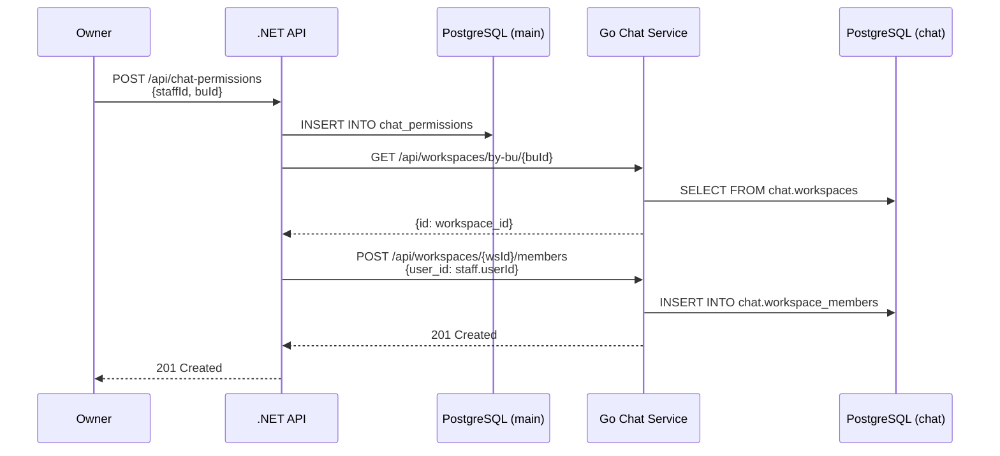

**เมื่อ Revoke Permission:**
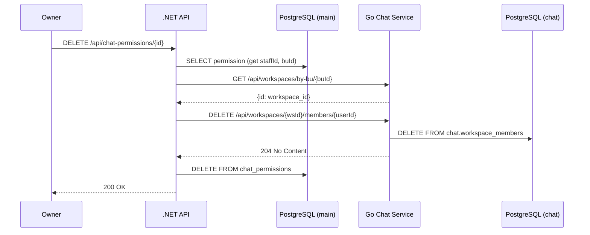

---

## 5. Role-Based Access Control (RBAC)

### 5.1 Role Hierarchy

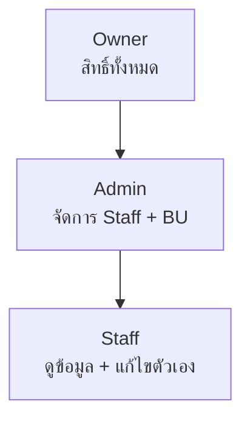

### 5.2 Permission Matrix

| Action | Owner | Admin | Staff |
|--------|:-----:|:-----:|:-----:|
| สร้าง Business Unit | ✅ | ✅ | ❌ |
| สร้าง Staff | ✅ | ✅ | ❌ |
| แก้ไข Staff Profile | ✅ | ✅ | เฉพาะตัวเอง |
| Reset Password ให้ Staff | ✅ | ✅ | ❌ |
| Set Password ให้ Staff | ✅ | ✅ | ❌ |
| เปลี่ยน Password ตัวเอง | ✅ | ✅ | ✅ |
| Grant/Revoke Chat Perms | ✅ | ❌ | ❌ |
| ดู Staff List | ✅ | ✅ | ✅ |
| ดู BU List | ✅ | ✅ | ✅ |

### 5.3 Implementation (MediatR Pipeline)

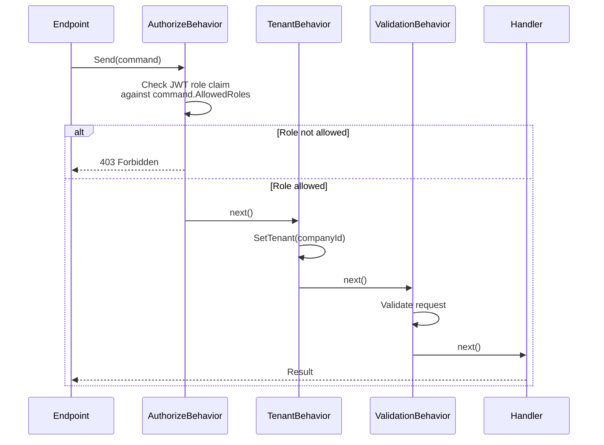

**MediatR Pipeline Order:**
1. `AuthorizeBehavior` — ตรวจ role (เฉพาะ commands ที่ implement `IAuthorizeRole`)
2. `TenantBehavior` — ตั้ง tenant filter (เฉพาะ commands ที่ implement `ITenantScoped`)
3. `ValidationBehavior` — validate ด้วย FluentValidation

---

## 6. Authentication Flow

### 6.1 Login + JWT Flow

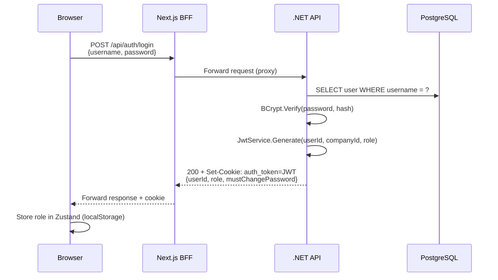

### 6.2 Cookie Configuration

| Property | Value | หมายเหตุ |
|----------|-------|----------|
| Name | `auth_token` | |
| HttpOnly | `true` | ป้องกัน XSS |
| SameSite | `Strict` | ป้องกัน CSRF |
| Secure | `false` | สำหรับ local dev (ควรเป็น `true` ใน production) |
| MaxAge | 24 hours | |

### 6.3 Password Management Flow

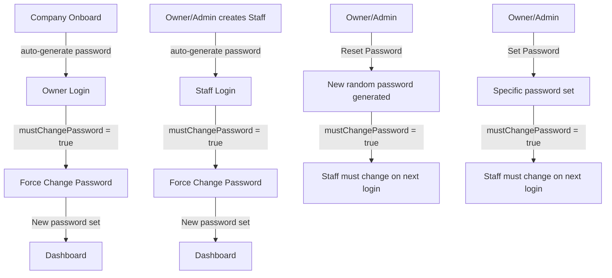

---

## 7. API Endpoints

### 7.1 Public Endpoints (ไม่ต้อง Authentication)

| Method | Route | หน้าที่ |
|--------|-------|--------|
| POST | `/api/companies/onboard` | สร้างบริษัท + Owner account |
| POST | `/api/auth/login` | เข้าสู่ระบบ |
| POST | `/api/auth/logout` | ออกจากระบบ |

### 7.2 Authenticated Endpoints (ต้อง Login)

| Method | Route | Role ที่อนุญาต | หน้าที่ |
|--------|-------|---------------|--------|
| POST | `/api/auth/change-password` | ทุก role | เปลี่ยน password ตัวเอง |
| POST | `/api/business-units` | Owner, Admin | สร้าง Business Unit |
| GET | `/api/business-units` | ทุก role | ดูรายการ BU |
| POST | `/api/staff` | Owner, Admin | สร้าง Staff |
| GET | `/api/staff` | ทุก role | ดูรายการ Staff |
| GET | `/api/staff/me` | ทุก role | ดู Staff Profile ตัวเอง |
| GET | `/api/staff/{id}` | ทุก role | ดูรายละเอียด Staff |
| PUT | `/api/staff/{id}/bu/{buId}` | ทุก role | แก้ไข BU-scoped data |
| POST | `/api/staff/{id}/reset-password` | Owner, Admin | Reset password ให้ staff |
| PUT | `/api/staff/{id}/password` | Owner, Admin | Set password ให้ staff |
| POST | `/api/chat-permissions` | Owner | Grant chat permission |
| DELETE | `/api/chat-permissions/{id}` | Owner | Revoke chat permission |
| GET | `/api/business-units/{buId}/chat-permissions` | ทุก role | ดู permissions ของ BU |

### 7.3 Go Chat Service Internal Endpoints

| Method | Route | หน้าที่ |
|--------|-------|--------|
| GET | `/api/workspaces/by-bu/:buId` | Lookup workspace จาก BU ID |
| GET | `/api/workspaces/:id` | ดูรายละเอียด workspace |
| GET | `/api/workspaces/:id/members` | ดูสมาชิก workspace |
| POST | `/api/workspaces/:id/members` | เพิ่มสมาชิก |
| DELETE | `/api/workspaces/:id/members/:uid` | ลบสมาชิก |

**หมายเหตุ:** Chat Service endpoints ไม่มี authentication — อาศัย network isolation (ไม่เปิดให้ frontend เข้าถึงตรง)

---

## 8. Company Onboarding Flow

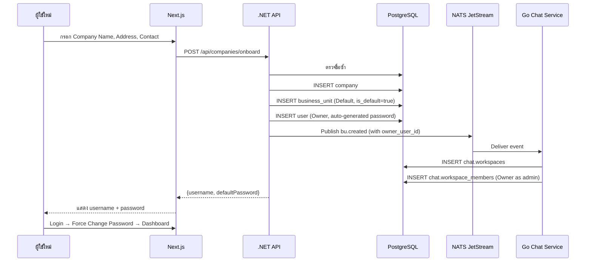
